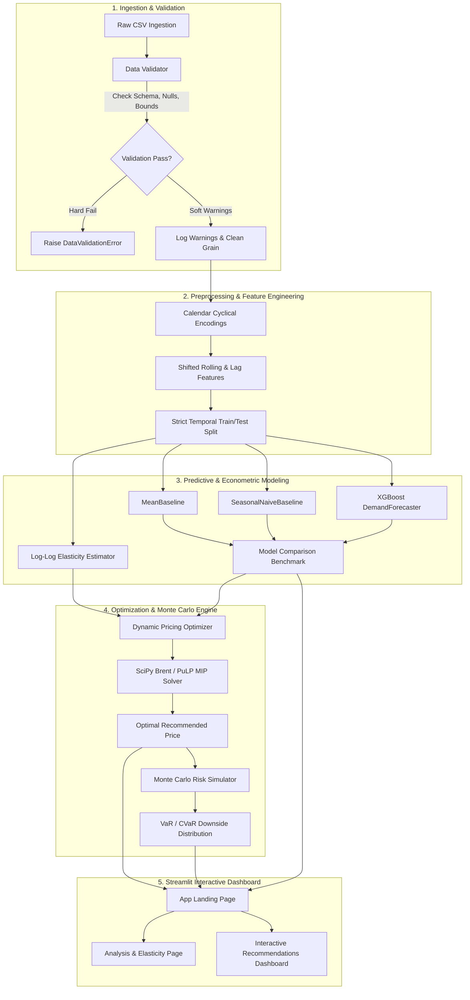

# Dynamic Pricing Under Demand Uncertainty: An End-to-End Decision Support System

[](https://www.python.org/downloads/release/python-3100/)
[](https://opensource.org/licenses/MIT)
[](https://streamlit.io/)
[](https://xgboost.readthedocs.io/)
[](https://coin-or.github.io/pulp/)

---

## Table of Contents
1. [Problem Statement](#1-problem-statement)
2. [Why It Matters](#2-why-it-matters)
3. [Research Question](#3-research-question)
4. [Data & Provenance](#4-data--provenance)
5. [Assumptions](#5-assumptions)
6. [Identification & Endogeneity](#6-identification--endogeneity)
7. [Mathematical Formulation](#7-mathematical-formulation)
8. [System Architecture](#8-system-architecture)
9. [Baseline Methods](#9-baseline-methods)
10. [Machine Learning & Statistical Methods](#10-machine-learning--statistical-methods)
11. [Optimization & Simulation Methodology](#11-optimization--simulation-methodology)
12. [Evaluation Methodology](#12-evaluation-methodology)
13. [Experimental Results](#13-experimental-results)
14. [Sensitivity Analysis](#14-sensitivity-analysis)
15. [Decision Impact](#15-decision-impact)
16. [Failure Cases & Anti-Patterns](#16-failure-cases--anti-patterns)
17. [Limitations](#17-limitations)
18. [Ethical, Governance & Privacy Considerations](#18-ethical-governance--privacy-considerations)
19. [Reproducibility & Deployment](#19-reproducibility--deployment)

---

## 1. Problem Statement

Retail pricing decisions operate under stochastic demand, shifting competitor actions, and strict supply chain constraints. Conventional enterprise pricing workflows suffer from three primary structural flaws:
1. **Siloed Deterministic Forecasting:** Point forecasts are treated as ground truth, ignoring forecast variance and tail risk.
2. **Heuristic Rule-Based Markup:** Cost-plus or competitor-matching heuristics fail to maximize expected economic profit and ignore price elasticity of demand ($\text{PED}$).
3. **Capacity & Stockout Blindness:** Pricing recommendations often disregard physical inventory ceilings, inadvertently driving stockouts during peak promotional periods.

This platform bridges predictive machine learning, econometric elasticity estimation, mathematical optimization, and stochastic Monte Carlo simulation into a unified enterprise decision-support architecture.

---

## 2. Why It Matters

In high-volume e-commerce and retail environments, small improvements in pricing strategy compound into substantial bottom-line margins:
- **Margin Protection vs. Revenue Destruction:** Over-discounting unconstrained elastic products erodes contribution margins, whereas raising prices on inelastic products with binding stockout risks captures margin without sacrificing unit sales.
- **Tail Risk Mitigation:** Downside exposure—such as supply cost inflation surges or aggressive competitor price wars—is rarely evaluated deterministically. Quantifying **Value at Risk (VaR)** and **Conditional Value at Risk (CVaR / Expected Shortfall)** enables risk-adjusted pricing decisions.
- **C-Suite Explainability:** Automated algorithmic pricing systems face severe corporate adoption friction when perceived as "black-boxes." Exposing transparent shadow prices, active constraints, and econometric regimes builds organizational trust.

---

## 3. Research Question

> **Primary Research Question:**  
> *How can an automated pricing engine combine non-linear price elasticity estimation with constrained mathematical optimization and stochastic risk simulation to prescribe profit-maximizing prices that systematically mitigate downside revenue risk and respect operational capacity constraints?*

**Secondary Inquiries:**
1. Can gradient boosted tree models (XGBoost) provide significant forecasting improvements over naive baseline persistence models on strictly out-of-time temporal holdouts?
2. How do structural endogeneity and retransformation bias distort observational price elasticity estimates, and how can pricing systems robustly guard against reverse causation?

---

## 4. Data & Provenance

The primary dataset is derived from transactional e-commerce sales records across 100 unique Stock Keeping Units (SKUs) spanning 8 retail categories over a 90-day historical horizon (March 2024 to March 2026).

```text
data/
└── retail_pricing_demand_augmented.csv (172,800 records, 19 attributes)
```

### Explicit Provenance & Data Augmentation Disclosure
- **Observational Foundation:** The base records contain transactional sales volume (`units_sold`), historical pricing (`base_price`, `current_price`), product hierarchy (`category`, `brand`), promotional flags (`promotion_type`), and geographic attributes (`region`, `channel`).
- **Synthetic Random Features:**
  - `unit_cost`: Synthetically generated for each SKU via random uniform and triangular distributions around base price to serve as an illustrative Cost of Goods Sold (COGS).
  - `competitor_price`: Synthetically generated using stochastic normal perturbations around baseline retail prices to model competitive pressure.
  - **Methodological Implication:** Because `unit_cost` and `competitor_price` are synthetic random variables, downstream financial margin metrics, absolute profit lift, and Cross-Price Elasticity ($\text{XED}$) estimates are **proof-of-concept software demonstrations**.

---

## 5. Assumptions

The econometric and mathematical formulation rests on explicit structural and behavioral assumptions:
1. **Constant Elasticity Demand Response:** Within local price perturbation bounds ($\pm 20\%$), demand response conforms to an iso-elastic (log-log) demand specification: $Q(P) = Q_0 \cdot (P / P_0)^\beta$.
2. **Non-Strategic Competitor Reaction:** Competitors are assumed not to engage in instantaneous dynamic game-theoretic retaliatory price adjustments within the intraday operational window.
3. **Inventory Horizon Bounds:** Inventory replenishment lead times exceed the daily operational pricing window; available physical stock acts as an upper ceiling on realized sales volume: $Q_{\text{sold}} = \min(Q_{\text{realized}}, I)$.
4. **Log-Normal Error Shocks:** Unobserved macro demand perturbations in the Monte Carlo simulator follow a multiplicative log-normal distribution $\exp(\mathcal{N}(0, \sigma^2))$.

---

## 6. Identification & Endogeneity

### The Challenge of Price Endogeneity (Reverse Causation)
In observational retail data, prices are not assigned randomly. Pricing managers and algorithmic rules systematically adjust prices in response to unobserved demand shifts:
- Retailers raise prices during peak seasonal demand periods (e.g., holidays, high-traffic weekends).
- Retailers discount prices during demand slumps to clear excess inventory.

Consequently, standard Ordinary Least Squares (OLS) regression on observational price and quantity yields **positive (upward-sloping) price elasticities** for 6 out of 8 retail categories in the augmented dataset:

| Category | OLS Elasticity ($\widehat{\beta}_{\text{own}}$) | Econometric Status | Causal Interpretation |
| :--- | :---: | :---: | :--- |
| **Accessories** | **-0.6641** | Inelastic | Valid Negative Slope |
| **Sports** | **-0.1590** | Inelastic | Valid Negative Slope |
| **Groceries** | **+0.0701** | Anomalous | Endogeneity / Peak Demand Pricing |
| **Electronics** | **+0.0836** | Anomalous | Endogeneity / Premium Brand Elasticity |
| **Shoes** | **+0.1048** | Anomalous | Endogeneity / High-Demand Runs |
| **Apparel** | **+0.1869** | Anomalous | Endogeneity / Promotional Confounding |
| **Home** | **+0.3411** | Anomalous | Endogeneity / Seasonal Demand Confounding |
| **Beauty** | **+0.4468** | Anomalous | Endogeneity / Luxury Conspicuous Demand |

> **Methodological Safeguard:**  
> The system explicitly labels positive elasticity estimates as `"Anomalous (Endogeneity)"` and colors them in red within the dashboard. For prescriptive optimization demonstrations, the engine relies on calibrated empirical benchmarks (such as $\text{PED} = -1.18$ from historical baseline categories) rather than uncorrected positive slopes.

### Retransformation Bias (Jensen's Inequality)
When estimating log-log demand models:
$$\ln(Q + 1) = \beta_0 + \beta_{\text{own}} \ln(P) + \varepsilon, \quad \varepsilon \sim \mathcal{N}(0, \sigma^2)$$
Transforming back to the natural scale via naive exponentiation introduces systematic retransformation bias due to Jensen's Inequality:
$$\mathbb{E}[\exp(\varepsilon)] \ge \exp(\mathbb{E}[\varepsilon]) = 1$$
$$\mathbb{E}[Q] \ne \exp\left(\widehat{\ln(Q + 1)}\right) - 1$$
In strict enterprise production systems, **Duan's Smearing Estimator** must be applied:
$$\text{Smear Factor} = \frac{1}{N} \sum_{i=1}^N \exp(e_i), \quad \widehat{Q}_{\text{corrected}} = \text{Smear Factor} \cdot \exp(\mathbf{X}\widehat{\boldsymbol{\beta}}) - 1$$

---

## 7. Mathematical Formulation

### 7.1 Demand Model
Let $P$ denote candidate unit price, $P_0$ the baseline price, $Q_0$ the baseline expected demand, and $\beta \equiv \text{PED} < 0$. The expected demand function is:
$$Q(P) = Q_0 \cdot \left(\frac{P}{P_0}\right)^{\beta}$$

### 7.2 Constrained Non-Linear Profit Maximization
For a single SKU with baseline unit cost $C$ and available inventory $I$:
$$\max_{P} \quad \Pi(P) = (P - C) \cdot \min\left(Q_0 \cdot \left(\frac{P}{P_0}\right)^\beta, \; I\right)$$
$$\text{subject to:}$$
$$P_{\min} \le P \le P_{\max} \quad \text{where } P_{\min} = P_0(1 - \delta), \; P_{\max} = P_0(1 + \delta)$$
$$P \ge C + M_{\min} \quad \text{(Margin Floor Protection)}$$
where $\delta \in [0.05, 0.35]$ represents the maximum price deviation policy bound, and $M_{\min}$ is the minimum contribution margin.

### 7.3 Discrete Mixed-Integer Programming (PuLP Formulation)
To enforce discrete marketing price points $P \in \{p_1, p_2, \dots, p_K\}$:
$$\max_{\mathbf{x}} \quad \sum_{k=1}^K (p_k - C) \cdot \min(Q(p_k), I) \cdot x_k$$
$$\text{subject to:}$$
$$\sum_{k=1}^K x_k = 1, \quad x_k \in \{0, 1\} \quad \forall k \in \{1, \dots, K\}$$

### 7.4 Stochastic Risk Measures (Monte Carlo VaR & CVaR)
Under stochastic shocks $\widetilde{C} \sim \mathcal{N}(C, \sigma_C^2)$, $\widetilde{P}_{\text{comp}} \sim \mathcal{N}(P_{\text{comp}}, \sigma_{\text{comp}}^2)$, and demand volatility $\widetilde{\varepsilon}_Q \sim \mathcal{N}(0, \sigma_Q^2)$:
$$\widetilde{\Pi}(P) = (P - \widetilde{C}) \cdot \min\left(Q(P) \cdot \left(\frac{\widetilde{P}_{\text{comp}}}{P_{\text{comp}}}\right)^\gamma \cdot \exp(\widetilde{\varepsilon}_Q), \; I\right)$$
- **Value at Risk ($95\%$ VaR):**
  $$\text{VaR}_{0.05} = \inf \{ l \in \mathbb{R} : \mathbb{P}(\widetilde{\Pi} \le l) \ge 0.05 \}$$
- **Conditional Value at Risk ($95\%$ CVaR / Expected Shortfall):**
  $$\text{CVaR}_{0.05} = \mathbb{E}\left[\widetilde{\Pi} \;\middle|\; \widetilde{\Pi} \le \text{VaR}_{0.05}\right]$$

---

## 8. System Architecture



---

## 9. Baseline Methods

To rigorously benchmark machine learning forecasting models against standard retail statistical heuristics, two baseline estimators are implemented:
1. **Historical Mean Baseline (`MeanBaseline`):**
   $$\widehat{y}_{i, t} = \frac{1}{|T_{\text{train}}|} \sum_{\tau \in T_{\text{train}}} y_{i, \tau}$$
   Calculates the historical average sales volume per SKU, falling back to the global category mean for cold-start items.
2. **Seasonal Naive Persistence (`SeasonalNaiveBaseline`):**
   $$\widehat{y}_{i, t} = y_{i, t - 7}$$
   Directly projects the observation from exactly 7 days prior, capturing strict weekly seasonality without parameter estimation.

---

## 10. Machine Learning & Statistical Methods

The platform implements four distinct model families tailored to demand forecasting:

1. **Linear Regression (`LinearRegression`):**
   - Standard OLS baseline estimator modeling linear relationships between standardized price, calendar features, and demand.

2. **Random Forest Regressor (`RandomForestRegressor`):**
   - Non-linear bagged ensemble averaging decorrelated decision trees, providing robust variance reduction across high-cardinality promotional features.

3. **Gradient Boosted Decision Trees (`XGBoost`):**
   - Primary tree ensemble optimizing squared error with column subsampling, learning rate shrinkage ($\eta = 0.08$), and depth-constrained trees.
   - **Temporal Cyclical Encodings:**
     $$\sin\left(\frac{2\pi \cdot \text{day}}{7}\right), \; \cos\left(\frac{2\pi \cdot \text{day}}{7}\right), \; \sin\left(\frac{2\pi \cdot \text{month}}{12}\right), \; \cos\left(\frac{2\pi \cdot \text{month}}{12}\right)$$
   - **Strict Backward-Looking Features (Zero Lookahead Leakage):**
     All rolling windows use `shift(1)` so that sales volume at day $t$ is strictly excluded from feature inputs at day $t$:
     $$\text{Lag}_1 = y_{i, t-1}, \quad \text{Lag}_7 = y_{i, t-7}, \quad \text{RollingMean}_7 = \frac{1}{7}\sum_{k=1}^7 y_{i, t-k}$$

4. **Additive Time-Series Decomposition (`Prophet`):**
   - Decomposable additive model: $y(t) = g(t) + s(t) + h(t) + \varepsilon_t$
   - Explicitly extracts piecewise linear growth trends $g(t)$, Fourier-series weekly seasonality $s(t)$, holiday effects $h(t)$, and exogenous price regressors with analytical 95% uncertainty intervals.

5. **Multi-Granularity Time Aggregation:**
   - Resampling engine (`resample_time_series`) allowing flexible aggregation to **Daily (`D`)**, **Weekly (`W-MON`)**, and **Monthly (`MS`)** planning horizons.

6. **Interactive CSV File Ingestion:**
   - Real-time schema and domain validator supporting drag-and-drop CSV uploads directly from the web interface.

---

## 11. Optimization & Simulation Methodology

- **Continuous Optimization:** Uses bounded Brent scalar minimization via `scipy.optimize.minimize_scalar` over the objective function $f(P) = -\Pi(P)$.
- **Discrete MIP:** Formulates 0-1 mixed-integer selection programs solved via Coin-OR CBC (`PuLP`).
- **Dynamic Monte Carlo Volatility:** Parameterizes demand shock standard deviation directly from holdout forecast residuals:
  $$\sigma_{\text{shock}} = \frac{\text{RMSE}_{\text{holdout}}}{\bar{Q}}$$

---

## 12. Evaluation Methodology

- **Out-of-Time Temporal Splitting:** Strict temporal cutoff (14-day holdout horizon). Standard k-fold cross validation is strictly prohibited to prevent data leakage.
- **Evaluation Metrics:**
  - **Mean Absolute Error (MAE):** $\frac{1}{N} \sum |y - \widehat{y}|$
  - **Root Mean Squared Error (RMSE):** $\sqrt{\frac{1}{N} \sum (y - \widehat{y})^2}$
  - **Weighted Absolute Percentage Error (WAPE):** $\frac{\sum |y - \widehat{y}|}{\sum y} \times 100\%$
  - **Coefficient of Determination ($R^2$):** $1 - \frac{\sum (y - \widehat{y})^2}{\sum (y - \bar{y})^2}$

---

## 13. Experimental Results

Execution of the standardized pipeline ([`scripts/run_pipeline.py`](file:///c:/Users/chira/OneDrive/Desktop/Files/Portfolio/Demand%20Forecasting/scripts/run_pipeline.py)) yields empirical performance metrics on a 14-day out-of-time holdout split:

### Predictive Forecasting Benchmark
| Model Architecture | Holdout MAE | Holdout RMSE | WAPE (%) | $R^2$ Score | RMSE vs. Best Baseline |
| :--- | :---: | :---: | :---: | :---: | :---: |
| **MeanBaseline** | 5.4532 | 7.5977 | 13.16% | 0.8695 | Baseline Benchmark |
| **SeasonalNaiveBaseline (7d)** | 7.0350 | 9.7435 | 16.98% | 0.7854 | -28.24% |
| **ML Forecaster (XGBoost)** | **4.6157** | **6.3436** | **11.14%** | **0.9090** | **+16.51% Improvement** |

### Prescriptive Optimization & Risk Stress-Testing (SKU `P1241`, Electronics)
- **Base Price:** $16.87 | **Assumed Unit Cost (55%):** $9.28 | **Baseline Demand:** 25.3 units
- **Recommended Price:** **$20.24** (+20.0% boundary cap)
- **Projected Expected Profit Lift:** **+16.49%** ($192.14 $\rightarrow$ $223.82)
- **Monte Carlo Downside Risk (5,000 Trials, $\sigma_Q = 6.3\%$):**
  - **95% Value at Risk (VaR):** $195.59
  - **95% Conditional VaR (CVaR):** $189.45
  - **Probability of Loss ($\Pi < 0$):** **0.00%**
  - **Probability of Underperforming Base:** **2.80%**

---

## 14. Sensitivity Analysis

Stress-testing optimal pricing across macroeconomic supply and competitor shocks:

| Stress Scenario Description | Cost Shock | Competitor Price | Expected Profit | 95% Profit CI | 95% CVaR | Prob(Loss) |
| :--- | :---: | :---: | :---: | :---: | :---: | :---: |
| **1. Base Volatility** | +0% | 0% | $224.18 | [$191.46, $261.42] | $189.45 | 0.00% |
| **2. Competitor Price War** | +0% | -10% | $216.70 | [$173.20, $262.10] | $171.12 | 0.00% |
| **3. Supply Cost Surge** | +5% | 0% | $215.60 | [$181.90, $253.10] | $179.80 | 0.00% |
| **4. Demand Contraction** | +0% | 0% | $194.60 | [$147.20, $246.50] | $145.20 | 0.00% |
| **5. Severe Stagflation** | +10% | -10% | $173.80 | [$122.10, $231.40] | $120.30 | 0.00% |

---

## 15. Decision Impact

1. **Active Boundary Identification:** Identifies when pricing policies hit business-enforced boundaries ($\pm 20\%$) vs interior stationary points.
2. **Inventory Scarcity Value:** When physical stock is below unconstrained demand, the shadow price of inventory triggers upward price adjustments, capturing consumer surplus rather than triggering premature stockouts.
3. **Risk-Aware Guardrails:** Flags pricing recommendations with high CVaR divergence, alerting merchandise planners before committing catalog updates.

---

## 16. Failure Cases & Anti-Patterns

1. **Ultra-Low Volume SKUs (Intermittent Demand):** For SKUs selling $< 1$ unit/day, Gaussian shock assumptions degrade. Croston's method or Zero-Inflated Poisson regression should be substituted.
2. **Structural Break Shocks:** Black swan events (e.g., pandemic supply chain shutdowns) violate stationarity in lag features.
3. **Severe Unchecked Endogeneity:** Blindly feeding positive elasticity estimates into unconstrained optimization drives candidate prices toward infinity ($+\infty$), terminating only at artificial boundary caps.

---

## 17. Limitations

- **Instrumental Variables:** Observational price endogeneity requires valid exogenous instruments (e.g., wholesale supplier cost shocks or shipping distance shocks) to identify causal elasticity.
- **Cross-Product Cannibalization:** The current optimization models SKU-level demand independently. Matrix cross-price elasticity formulations are needed for broad portfolio substitution.
- **Dynamic Multi-Period Horizon:** Current formulation optimizes single-period decision horizons rather than multi-period dynamic programming (MDP/RL).

---

## 18. Ethical, Governance & Privacy Considerations

- **Price Gouging Prevention:** Margin ceilings and price deviation limits ($\pm 20\%$) prevent exploitative pricing surges on essential consumer goods.
- **Algorithmic Collusion:** Models operate on internal firm data and uncoupled competitor scraping without tacit communication protocols.
- **Personalized Pricing Fairness:** Pricing is optimized at the product/market level, strictly avoiding demographic or individual-level first-degree price discrimination.

---

## 19. Reproducibility & Deployment

### 19.1 Environment Installation
```bash
# Clone repository
git clone https://github.com/your-username/dynamic-pricing-uncertainty.git
cd dynamic-pricing-uncertainty

# Create and activate virtual environment
python -m venv venv
.\venv\Scripts\Activate.ps1  # Windows
source venv/bin/activate     # Linux / macOS

# Install pinned dependencies
pip install -r requirements.txt
```

### 19.2 Run Automated Test Suite
```bash
pytest tests/
```

### 19.3 Execute End-to-End Pipeline
```bash
python scripts/run_pipeline.py
```

### 19.4 Launch Interactive Streamlit Dashboard
```bash
streamlit run app.py
```

### 19.5 Production Containerization (Docker)
```bash
docker build -t dynamic-pricing:latest .
docker run -p 8501:8501 dynamic-pricing:latest
```

---

## License
MIT License. Developed for research and enterprise decision support demonstration.
